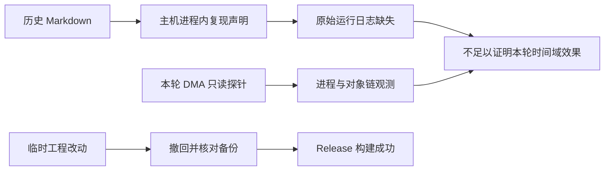

# AddDelay 文档核对与工程恢复记录

日期：2026-09-11。原目标尚未完成：没有证明本次 DMA 时间域效果，没有保留新增功能或 UI 开关。

## 核对结果

| 证据级别 | 结论 | 来源 |
| --- | --- | --- |
| Observed | 当前项目 MCP 文档明确区分副机工具与主机目标；本机进程枚举不能替代 DMA 返回的目标状态。 | `../../../docs/mcp-server-usage.md` |
| Observed | AddDelay 目录包含五份 Markdown；本次核对的四份历史运行日志均不存在于其引用位置。 | `../evidence/final-verification.json` |
| Observed | 历史复现使用主机进程内探针；文档声称客户端时间字段改变并恢复，明确未验证服务器命中或伤害。 | `../../../dump_workspace/research/adddelay-time-domain/2026-09-11_AddDelay复现验证.md` |
| Observed | RUNBOOK 的持续运行描述落后于 field-journal 中的停止、恢复和卸载记录。 | 同目录 `RUNBOOK.md`、`field-journal.md` |
| Inferred | 历史文档中的成功标签不能证明本次 DMA 执行路径或当前效果。 | 通道不同且原始日志缺失。 |
| Observed | 后续 CrossFade 调查把早期确定性根因降为假设：页权限、异常原因、主动退出及具体故障指令仍未证实。 | `../../../docs/memory-shock-crash-execution-plan-round4-v5-20260906.md` |

文档只读审查与此前 DMA 只读探针必须区分。此前工具在本会话中报告了一个活动目标进程和有效模块、对象链，但没有采集 AddDelay 连续时间字段基线，也没有证明时间域效果；这不是现在的主机存活证明。



## 本次工程处理

此前在效果验证前提前加入了临时实现与 UI 开关。该顺序不符合原请求的“先复现成功、后集成”。审查还发现失败时状态不准确、缺少目标身份绑定及退出恢复等缺口。因此临时新增内容已撤回，没有运行生成的功能。

- `Hook.cpp`、`Hook.h`、`Data.cpp`、`Data.h`、`Menu.cpp` 均已恢复至本次修改前备份，逐字节一致。
- `Naraka.vcxproj` 未修改，也与备份逐字节一致。
- `Offset.h` 的本次新增条目已移除；没有修改前文件备份，不能声称其整体字节与初始文件完全一致。撤回过程统一了该文件的 CRLF 换行。
- 六份相关源码中均未检出本次新增功能标识。
- 恢复后重新构建 `Release|x64`，MSBuild 返回 0。当前编译器为本机 VS 安装提供的 v145，并非文档假设的 VS 2022/v143。
- 构建仍报告目录尾斜杠和字符窄化等 warning；没有将它们写成零警告构建。

二进制重新构建后不是历史二进制的逐字节还原。构建过程还刷新了输出目录内工程规定的依赖 DLL；具体文件列在日志中。

## 验证材料

- `../evidence/source-rollback.json`：源码撤回记录及 SHA-256。
- `../evidence/final-verification.json`：再次比较备份、检查新增标识消失、缺失日志盘点、最终 EXE 哈希。
- `../evidence/naraka-restored-build.log`：恢复后构建日志。
- `../artifacts/prechange/`：修改前备份。

可重复构建命令：

```powershell
& 'J:\vs2026\MSBuild\Current\Bin\MSBuild.exe' `
  'J:\Code\C++\dma\er_new\YJWJ_DMA_NEW\Naraka\Naraka.vcxproj' `
  /p:Configuration=Release /p:Platform=x64 /m /v:minimal
```

没有执行主机目标写入，没有复现 AddDelay 时间域效果，没有保留 UI 开关。MCP 服务启动曾因 Windows 要求提升而失败；这是启动工具的错误，不是目标进程行为证据。报告由助手依据本轮文件读取与工具结果整理，未补造缺失日志或游戏画面确认。
