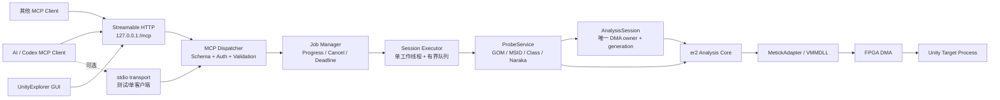
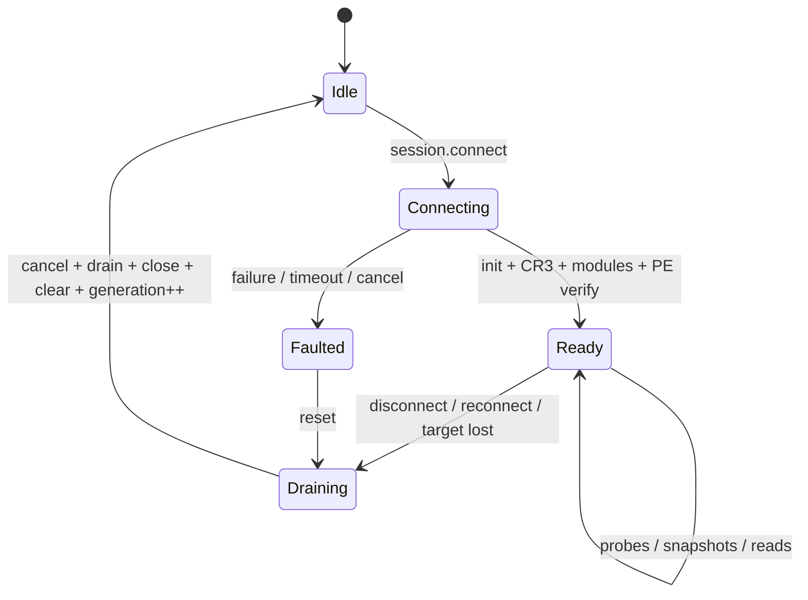

# UnityExplorer 常驻 MCP 服务改造方案

> 状态：设计草案（本文件只定义改造边界，不包含实现代码）  
> 日期：2026-09-04  
> 目标平台：Windows x64、Visual Studio 2022/MSVC、MemProcFS/VMMDLL、FPGA DMA

## 1. 结论

本项目应从“GUI/Headless 前端各自初始化 DMA 并直接调用 `er2`”改造成“一个常驻分析服务独占 DMA 会话，GUI 和其他 AI 都通过服务调用”。推荐最终形态是：

- 新增常驻进程 `UnityExplorerMcpServer.exe`；
- 服务进程启动后持续运行；`session.connect` 成功后持续持有并复用 `VMM_HANDLE`、目标 PID、CR3/DTB、模块信息与 `er2` 上下文；
- MCP 使用仅绑定 `127.0.0.1` 的 **Streamable HTTP**，允许工具先由用户以管理员权限启动，随后一个或多个 AI 客户端连接；
- 同一个服务核心保留 `stdio` transport，供协议测试和能够可靠继承管理员权限的单客户端环境使用；
- GUI 最终也改为该服务的客户端，避免 GUI 与 MCP Server 各自打开 FPGA/VMMDLL；
- 所有 DMA/VMMDLL/Scatter 操作由一个串行 executor 执行；HTTP 可以并发接收请求，但不能并发触碰底层全局状态；
- 首个可用版本默认只读；完整改造必须交付受控 typed write。任意地址 raw write 保持可选，并要求 capability、范围校验、compare-before-write、readback 和审计。

这不是“启动一次 EXE，然后反复读取日志”。当前程序本来就是运行时直接通过 `VMMDLL/MemProcFS -> FPGA DMA -> 目标进程` 读内存，日志/JSON/CSV 只是读取后的结果。MCP 改造是在这条调用链前增加结构化、可反复调用的控制面。

## 2. 需求与非目标

### 2.1 必须满足

1. 服务启动后保持运行，目标进程暂时不存在或重启时也不退出。
2. `session.connect` 成功后复用同一个 DMA/VMM 会话，不在每次 tool call 中重新初始化硬件。
3. AI 可反复执行内存读取、GOM/MSID 扫描、对象/类型/字段/方法检查和 Naraka Probe。
4. 支持连接、断开、重连、目标 PID 变化和 DLL 变体变化，并能拒绝旧地址。
5. 慢扫描可查询进度、取消和超时，不能永久卡住 MCP Server。
6. 多个客户端并发调用时，结果可预测，不破坏 Scatter 状态或全局上下文。
7. 完整改造必须支持受控 typed target-memory write，且不绕过统一权限和审计层；raw write 可选。

### 2.2 本次改造不做

- 不通过解析 ImGui 日志反推出实时内存状态；
- 不把 `ExternalResolveConsole.exe --headless` 每次重启一次作为最终架构；
- 不允许 MCP handler 直接读写 `g_appState`、`er2::g_ctx` 或裸 `DmaData::*`；
- 不把 `GameOffsets.h` 或旧候选 RVA 自动视为当前生产偏移；
- 不让任意客户端向任意文件系统路径导出文件；
- 不在第一阶段开放任意地址写入。

## 3. 当前实现基线

### 3.1 已验证的运行逻辑

当前仓库有两个可执行前端：

| 前端 | 入口 | 当前行为 |
| --- | --- | --- |
| `UnityExplorer.exe` | `App/UnityExplorer/main.cpp` | Win32/DX11/ImGui 消息与渲染循环；按钮触发连接、扫描和 Probe。 |
| `ExternalResolveConsole.exe` | `App/ExternalResolveConsole/main.cpp` | `--headless` 初始化 DMA、顺序执行所选 Probe、写 JSON/log/CSV/dump 后退出；非 Headless 分支才有无限轮询。 |

DMA 初始化的实际链路是：

```text
MetickAdapter::Initialize(target.exe)
  -> mem::SetTargetProcessName(...)
  -> mem::DMA_Init()
  -> VMMDLL_Initialize(... fpga ...)
  -> mem::Get_Process_Id(...)
  -> MetickAdapter::FixCr3()
  -> module enumeration / PE readback
  -> er2 context initialization
```

`IMemoryAccessor` 已定义 `Read` 和 `Write`，`MetickAdapter::Write` 最终调用 `VMMDLL_MemWrite`。但是现有 GUI/Headless 的分析业务没有目标内存写流程，因此当前产品能力应描述为“应用层只读，底层具备写原语”。

当前仓库未发现 MCP、JSON-RPC、HTTP、Socket、Named Pipe 或 Shared Memory 服务接口。因此当前 AI 自动化只能启动 CLI、传参、等待完成并读取 stdout/文件，不能向已经运行的 GUI 发送结构化读写请求。

### 3.2 常驻化前必须治理的问题

| 问题 | 代码证据 | 常驻风险 | 改造要求 |
| --- | --- | --- | --- |
| `er2` 上下文全局化 | `include/er2/unity2/init/context.hpp:40-72,127-149` | 请求与 `ResetContext()` 并发会读到半重置状态或失效 accessor | 仅 `AnalysisSession` 可进入/重置上下文；所有调用走 executor |
| DMA 状态全局化 | `deps/Memory/Mem.h:11-23`、`Mem.cpp:60-79` | 重连覆盖全局 handle/PID，可能泄漏或跨目标串线 | RAII 单 owner；明确 Close、清缓存、幂等断开 |
| Scatter 无锁且复用 | `App/UnityExplorer/MetickAdapter.hpp:141-185` | 并行 Probe 会混合请求、buffer 和 Clear | DMA 调用串行；或以后改为每个 job 独立 Scatter handle |
| GUI 使用 detached threads | `App/UnityExplorer/main.cpp:2508-2613,3789-3794,3823-3836,3892-3902` | 扫描、连接、FixCR3、断开可互相竞争 | 禁止 transport 复用这些 UI 回调；抽取 service，再由 UI 提交 job |
| Headless log callback 捕获局部对象 | `App/ExternalResolveConsole/main.cpp:3364-3371` | 直接把单次函数改成循环会留下 dangling callback | 使用生命周期受控的 `ILogSink`/scoped subscription |
| CR3 等待无 deadline | `deps/Memory/Mem.cpp:182-197,315-332` | 一个请求可永远占住服务 | 注入 cancellation token、deadline、轮询上限和阶段进度 |
| stdout 混杂日志 | `Mem.cpp:178,255,282,329`、Headless `main.cpp:3368-3371` | 破坏 stdio 的 newline-delimited JSON-RPC framing | 协议 stdout 专用；日志只到 stderr/滚动文件/通知 |
| 模块默认取首个前缀匹配 | `include/er2/unity2/init/module_match.hpp` | 多个 `GameAssembly*.dll` 时可能静默选错 | 返回全部候选；支持显式模块名；歧义时报错 |
| 管理员清单 | 两个 `.vcxproj` 的 `RequireAdministrator` | elevation prompt 与客户端启动模型可能使自动 spawn/stdio 通信不可用（待实测） | 推荐手工/受控启动 elevated HTTP 服务；stdio 只作兼容模式 |

## 4. 目标架构



核心原则：

- **单一所有权**：一个 server process、一个 active `AnalysisSession`、一个 VMM handle owner。
- **并发入口、串行硬件**：HTTP/parser 可以在 I/O 线程并发；涉及 DMA 的任务按队列串行。
- **Core 与 transport 解耦**：MCP 只调用 typed service；CLI 与 GUI 也复用同一 service。
- **地址有代次**：所有跨请求保存的地址都绑定 `generation`，重连即失效。
- **结果是 snapshot**：DTO 离开 executor 前复制完成，响应序列化不持有目标对象裸指针。

### 4.1 进程拓扑与 transport 选择

`sidecar/embedded` 是进程拓扑，`stdio/Streamable HTTP` 是 MCP transport，二者不是同一维度。

| 选择 | 是否符合“软件先启动，AI 后连接” | 多客户端 | 结论 |
| --- | --- | --- | --- |
| GUI 内嵌 + stdio | 否；通常由 client 拉起，且 GUI stdout 易污染 | 单连接为主 | 不采用 |
| GUI 内嵌 + HTTP | 是 | 可以 | 可作后期单进程发行选项，但 GUI 崩溃会带走服务 |
| 独立 sidecar + stdio | 部分符合；适合 client 管理生命周期 | 单连接为主 | 保留为测试/MVP transport |
| 独立 sidecar + loopback HTTP | **完全符合** | 可以 | **最终推荐** |
| 每次 tool spawn Headless | 否；每次重新初始化 DMA | 否 | 仅用于最薄协议 PoC |

MCP 当前规范将 stdio 定义为 client-launched subprocess 上的逐行消息；Streamable HTTP 则让 server 作为独立进程处理多个 client connection。用户要求的生命周期与后者一致。

### 4.2 推荐组件

```text
src/
  analysis_core/
    analysis_session.{hpp,cpp}
    session_executor.{hpp,cpp}
    probe_service.{hpp,cpp}
    job_manager.{hpp,cpp}
    dto/*
    log_sink.{hpp,cpp}
  mcp/
    mcp_server.{hpp,cpp}
    tool_registry.{hpp,cpp}
    result_codec.{hpp,cpp}
    transports/stdio_transport.{hpp,cpp}
    transports/streamable_http_transport.{hpp,cpp}
  app/
    mcp_server_main.cpp

App/
  UnityExplorer/                 # 逐步改为 AnalysisCore/MCP client
  ExternalResolveConsole/        # 逐步改为 AnalysisCore client
  UnityExplorerMcpServer/        # 新 MSVC Application project

tests/
  analysis_session_smoke/
  session_executor_smoke/
  mcp_protocol_smoke/
  mcp_write_guard_smoke/
```

实际落地可保持仓库现有 `include/er2` header-only 结构，但服务状态、transport 和 JSON-RPC parser 不应继续塞进两个大型 `main.cpp`。

#### `AnalysisSession`

唯一拥有：

- `std::unique_ptr<MetickAdapter>` 与 RAII VMM handle owner；`er2::g_ctx` 现阶段仍是全局对象，但仅允许本 session 控制；
- PID、目标进程名、运行模式；
- UnityPlayer/GameAssembly 的精确模块名、base、size、PE identity；
- CR3/DTB 状态；
- session state 与单调递增 `generation`；
- 与本代连接关联的 GOM/MSID/metadata 缓存。

状态机：



受当前 `DmaData::vHandle/PID` process-global 限制，同一进程内不能安全地一边保留旧 VMM 会话、一边建立候选新会话。`Ready` 状态默认拒绝第二次 connect；显式 `replace=true` 时必须执行 `drain -> close old -> clear -> generation++ -> connect new`，新连接失败则进入 `Faulted/Idle`。只有先完成句柄去全局化或使用隔离 broker，才可评估“两阶段 publish、失败保留旧会话”。

#### `SessionExecutor`

- 一个工作线程、一条有界 FIFO 队列；
- 每个 job 含 request id、priority、deadline、cancellation token、expected generation；
- connect/disconnect/reconnect 是 exclusive barrier；
- 短读可以插队到“短任务”优先级，但不可打断正在执行的非协作式 VMMDLL 调用；
- 队列满返回 `busy`，不无限堆积；
- 同步 HTTP request 的 SSE 关闭时向该 request job 传播 cancellation；已经返回 `jobId` 的持久后台 job 是否继续由 `detachOnDisconnect` 与 job owner policy 明确决定；
- server shutdown：停止接收 -> cancel queued -> 等待 active deadline -> close session。
- executor 记录 active job heartbeat；超过硬 deadline 且底层 VMMDLL 调用仍不返回时，将 session 标记 `wedged`。生产形态应允许 watchdog 终止并重启 DMA broker process，因为同一进程中无法安全强杀卡住的 C++ 线程。

#### `ProbeService`

把当前 Headless 中的顺序函数和 GUI 回调抽为无 UI 的 typed operations。每个 operation 接收不可变参数与 `SessionView`，返回 DTO，不直接拼接 GUI 字符串或文件路径。

#### DTO / Codec

服务内部使用 C++ DTO；MCP codec 负责 JSON Schema、JSON-RPC、hex 地址、分页和 error 映射。不要继续通过手工 `ostringstream` 拼完整协议消息。仓库已有 `deps/Naraka/json.hpp`（nlohmann/json 副本），但其归属、license、版本统一及能否提升为 MCP 的公共依赖仍需评估；当前未发现现成 HTTP/MCP server 库。

## 5. MCP 接口设计

工具名使用稳定、可发现的 `unity_*` 前缀。参数 Schema 设 `additionalProperties: false`，返回同时提供人类可读 `content` 与机器可读 `structuredContent`/`outputSchema`。

Server 声明 `tools` capability，并以确定性顺序返回 `tools/list`（`resultType: "complete"`）。工具集合不能随某条连接或 DMA session state 的副作用忽隐忽现；只读/写入工具只按 server 启动配置和该请求的 authorization scope 固定过滤。定义 `outputSchema` 后，`structuredContent` 必须严格符合它；为兼容不同客户端，同时返回内容等价的 JSON `TextContent`。

多客户端不能共享一个无身份的管理权限：认证主体至少含稳定 `clientId` 和 scopes（`read`、`session.admin`、`write.typed`、`write.raw`）。connect/disconnect/reconnect 需要 `session.admin`；job 记录 owner，只有 owner 或 admin 可取消；会改变状态的调用接受 `idempotencyKey`，并按 generation + owner 解决冲突。

### 5.1 Phase 1：会话与只读工具

| MCP tool | 关键输入 | 输出/语义 |
| --- | --- | --- |
| `unity_session_connect` | `targetProcess`, `mode=dma`, `unityPlayerName?`, `gameAssemblyName?`, `timeoutMs`, `replace?` | 初始化一次；返回 PID、CR3、全部匹配候选、最终选择和 generation |
| `unity_session_status` | 无 | state、generation、PID、模块、队列、active job、health、write policy |
| `unity_session_disconnect` | `expectedGeneration`, `timeoutMs` | cancel/drain、关闭 handle、清缓存、generation++ |
| `unity_modules_list` | `expectedGeneration`, `cursor?`, `limit?` | 分页模块列表；base/size 均为 hex string |
| `unity_memory_read` | `expectedGeneration`, `address` 或 `module+rva`, `length`, `nocache?` | Base64/hex bytes、actual length、read evidence；受读取策略限制 |
| `unity_gom_scan` | generation、scan options | GOM slot、候选和评分证据 |
| `unity_gameobjects_list` | generation、filter、cursor、limit | 分页 GameObject snapshot |
| `unity_msid_scan` | generation、scan options | MSID slot、候选、计数 |
| `unity_objects_list` | generation、type/name filter、cursor、limit | managed/native object snapshot |
| `unity_class_probe` | generation、object/klass address、layout profile? | class header、namespace/name、有效性证据 |
| `unity_class_fields` | generation、klass、cursor、limit | fields、offset、type、flags |
| `unity_class_methods` | generation、klass、cursor、limit | methods、native address/RVA；signature 为 best-effort/partial，并带 confidence/evidence |
| `unity_native_chain_probe` | generation、root、steps、validation | 每层地址、失败层和读取证据 |
| `unity_camera_main` | generation | camera 和矩阵 snapshot |
| `unity_transform_world_position` | generation、transform | position 与层级验证 |
| `unity_manager_scan_start` | generation、scan bounds、timeoutMs | 返回 `jobId`，不占住普通 HTTP 请求直到全扫描完成 |
| `unity_naraka_buff_snapshot` | generation、可选已验证 RVA | BuffManager 链和容器 snapshot |
| `unity_naraka_runtime_property_sample_start` | generation、samples、intervalMs、timeoutMs | 返回采样 jobId |
| `unity_naraka_ground_snapshot` | generation | ground/collision snapshot |
| `unity_naraka_actor_containers_snapshot` | generation、selector | 容器和 actor snapshot |
| `unity_job_status` | `jobId`, `cursor?` | queued/running/completed/failed/cancelled、progress、分页结果 |
| `unity_job_cancel` | `jobId` | 协作式取消 |
| `unity_metadata_export_start` | generation、export options | 后台导出，完成后返回 artifact URI |
| `unity_runtime_dump_export_start` | generation、dump options | 后台导出 runtime dump，并标注 runtime-only 能力限制 |

### 5.2 Resources 与大结果

小结果直接返回 `structuredContent`。下列内容不应塞进单次 tool result：

- runtime `dump.cs`；
- metadata dump；
- 长时间采样 CSV；
- 大型完整模块/对象列表；
- 大块原始内存。

服务只在配置的 artifact root 下生成不可执行文件，并返回例如：

```text
unity-artifact://session/7/job/a13f/result.json
unity-artifact://session/7/job/a13f/runtime-dump.cs
```

通过分页 resource URI/template（或明确的自定义 chunk tool）分块读取；`resources/read` 本身没有通用 offset/length 参数，不能假设客户端原生支持。URI 必须映射到 server 内部 ID，不能把客户端传入路径直接拼到文件系统。

### 5.3 统一结果约定

所有地址、RVA、size 边界和 64-bit 标识都用 hex string，避免 JSON/JavaScript 的 53-bit integer 精度损失。

```json
{
  "ok": true,
  "session": {
    "generation": 7,
    "state": "ready",
    "pid": 1234,
    "target": "NarakaBladepoint.exe",
    "runtime": "il2cpp",
    "unityPlayer": "UnityPlayer_LVB.dll",
    "gameAssembly": "GameAssembly_Super.dll"
  },
  "data": {},
  "evidence": {
    "timestamp": "2026-09-04T12:00:00.000+08:00",
    "moduleBase": "0x00007FF700000000",
    "source": "dma"
  },
  "warnings": []
}
```

约定错误码：

| Code | 含义 |
| --- | --- |
| `not_connected` | session 非 Ready |
| `target_not_found` | 找不到目标进程 |
| `dma_init_failed` | VMM/FPGA 初始化失败 |
| `cr3_failed` | CR3/DTB 修复或验证失败 |
| `module_not_found` | 缺少必需 runtime module |
| `module_ambiguous` | 多个候选但未显式选择 |
| `read_failed` / `write_failed` | 底层操作未完成 |
| `busy` | 队列或资源达到上限 |
| `stale_generation` | 地址属于旧连接代次 |
| `permission_denied` | capability/policy 不允许 |
| `invalid_argument` | Schema 之外的业务参数错误 |
| `timeout` / `cancelled` | deadline 到期或调用方取消 |
| `target_changed` | PID/模块 identity 已变化 |

已识别 tool 的执行/业务失败通常仍返回正常 `tools/call` result：`resultType: "complete"`、`isError: true`，并在 `content/structuredContent` 中保留稳定错误字段。JSON-RPC error 只用于 parse、invalid request、unknown method/unknown tool、协议或参数 Schema 错误。

## 6. 连接生命周期与失效检测

### 6.1 启动

1. Server 解析固定配置，初始化日志、artifact store、auth token 和 transports。
2. 默认进入 `Idle`，MCP endpoint 已可用；是否自动连接由配置决定。
3. `session.connect` 在 executor 中完成 FPGA/VMM、PID、CR3、模块枚举和 DOS/PE readback。
4. 只有所有必需检查通过才发布 `Ready` snapshot。

### 6.2 保活与目标重启

每 1 秒在 executor 空闲窗口执行轻量 health check：PID 存活、模块基址可读、PE identity 未改变。连续 N 次失败后进入 `Draining`，取消该 generation 的 queued jobs，清空缓存并关闭会话。配置 `autoReconnect=true` 时按带抖动的指数退避重试，但 endpoint 始终保持运行。

### 6.3 `generation`

- 一进入 `Draining`、停止接纳本代新任务时就递增并使旧代失效；成功连接发布新的 generation；
- 所有接收地址/RVA/object handle 的 tools 必须携带 `expectedGeneration`；
- server 在真正读取前再次比较，不只在 HTTP 收包时比较；
- 缓存 key 包含 generation；跨代禁止复用 GOM/MSID/class/object 地址；
- 返回结果总是带实际 generation。
- job 只捕获不可变输入，不捕获 accessor、`SessionView` 或裸指针；执行开始及长任务每个 chunk 都复核 generation、PID creation time 与 PE identity。

### 6.4 Shutdown

控制台 Ctrl+C、Windows service stop 或 GUI 的明确停止操作触发 graceful shutdown：停止新调用，取消等待任务，等待 active VMM call 实际返回，关闭 Scatter，再关闭 VMM handle，清除 `er2` context，flush audit/log，最后退出。不得在另一个线程仍执行 VMM call 时强行 close handle；若 drain 超过硬时限，由 supervisor 终止并重启隔离的 DMA broker process，而不是在进程内强杀线程。

## 7. 并发、长任务与性能

### 7.1 并发模型

```text
HTTP I/O threads
  -> schema/auth/rate validation
  -> bounded command queue
  -> one SessionExecutor thread
  -> immutable result DTO
  -> HTTP serialization threads
```

首版严禁让多个 request thread 同时调用 `er2::Mem()`。这会牺牲部分吞吐，但能先保证现有全局上下文、MemIO cache 和 Scatter 行为正确。优化只能在量化后进行，例如将一次 Probe 内部合并为 Scatter batch，而不是增加并行调用者。

`job.status`/`job.cancel` 直接访问线程安全 metadata 和原子 stop flag，不排在 DMA 队列尾部；disconnect 收包后先关闭该 generation 的 admission 并发出 cancel，再排 exclusive barrier。长扫描按 page/chunk 量子执行，每个 chunk 必须完成并清空 job-local Scatter 后 yield/requeue；采样间隔由 timer continuation 驱动，禁止在唯一 executor 中 `sleep`。这样 health check、短读和取消才不会被全模块扫描饿死。

### 7.2 长任务

- 预计低于 2 秒：同步 tool result；
- 预计超过 2 秒或结果很大：`*_start` 返回 `jobId`；
- `job.status` 返回阶段、`completed/total`、耗时、warning 和结果 URI；
- 扫描循环每个 page/chunk 检查 cancellation/deadline；
- 单次 VMMDLL API 若本身不支持取消，只能等待该调用返回，因此外层必须限制输入规模并记录 `cancellation_pending`；watchdog 负责识别 wedged broker 并按策略重启。

默认限制建议（实施时以基准测试调整）：

| 限制 | 默认值 |
| --- | --- |
| 队列深度 | 64 jobs |
| 同时 active DMA job | 1 |
| `memory.read` | 每次 64 KiB；分页/分块 |
| 普通 list page | 100 items，最大 500 |
| 默认短请求 timeout | 5 s |
| connect/CR3 timeout | 30 s |
| 全模块扫描 timeout | 120 s |
| 单 client 请求速率 | 20 req/s，burst 40 |

## 8. 目标内存写入设计

写入是完整改造的必达调试能力，但不能直接把 `IMemoryAccessor::Write` 原样注册为 MCP tool。Core 首先提供不暴露 `Write` 的 `IReadOnlyMemory` facade，所有 Probe 与普通 MCP handler 只能持有该接口；写原语仅存在于不可 downcast 的 `WriteService` capability object 中。

### 8.1 分阶段开放

1. **Phase 1**：不注册任何 write tool，`session.status` 显示 `writePolicy=disabled`。
2. **必达阶段**：支持预先配置的 typed debug actions，地址由 server 根据当前模块/对象链计算。
3. **可选阶段**：再考虑 `unity_memory_write` raw write，默认仍关闭，启动参数与 token scope 必须同时开启。

### 8.2 每次写入必须满足

- session 为 Ready 且 `expectedGeneration` 相符；
- 请求具有独立 `memory.write` scope；
- 以防溢出的半开区间计算 `[address,address+length)`；地址须为 canonical user VA，并完整落在当前 PID/current generation 的单一 allowlist region，验证页属性、module identity 与跨页策略；
- 单次最大 256 bytes，禁止默认跨页；
- 必填 `expectedBefore`；before 与 readback 都使用 direct `NOCACHE` exact read，并在同一 executor 中紧邻 write 再比较，写后清理/刷新相关 cache；
- 可选 `mask`；`expectedBefore`、data、mask 长度一致，并满足 `(before XOR desired) & ~mask == 0`；
- 请求带 `idempotencyKey`，防 client timeout 重试造成二次写；
- audit 采用 write-ahead + completion record；若审计不可持久化则拒绝写，记录 caller/token ID/hash 而非 secret；
- server 记录 before/desired、执行写入、立即 readback；readback 不同返回 `outcome=partial/indeterminate`。只有预定义 typed action 在重新验证回滚前置条件后才可条件式 rollback，raw write 不盲目覆盖目标并发变化；
- 每个 session 有速率与累计写入上限；
- disconnect、PID/module identity 变化或 health failure 立即禁止新写入。

建议请求：

```json
{
  "expectedGeneration": 7,
  "address": "0x000001F012345678",
  "encoding": "hex",
  "data": "01000000",
  "expectedBefore": "00000000",
  "reason": "runtime field debug",
  "verifyReadback": true
}
```

推荐优先使用 `module + rva` 或已验证 typed handle，而不是裸绝对地址。

## 9. MCP 与本地服务安全

Streamable HTTP 按 MCP 规范实现单一 `/mcp` POST endpoint，并满足：

- 只绑定 `127.0.0.1`（可选同时绑定 `::1`，需单独测试）；
- 校验每个请求的 `Origin`，存在但不在精确 allowlist 时返回 403，防 DNS rebinding；浏览器客户端列出精确 Origin，不默认放行 `Origin: null`；native client 无 Origin 时仍必须认证并符合显式 local policy；
- 使用启动时生成或配置的高熵 Bearer token；token 不写 stdout，不出现在 URL。它属于本项目 local deployment profile 的自定义认证，不等同 MCP HTTP OAuth；若要声明完整 MCP Authorization 合规则实现规范 OAuth 流程，兼容性在 Spike 中确认；
- 禁止 wildcard CORS；限制 body、header、SSE、请求并发、队列和 idle timeout；
- 每个 POST 校验 `Accept` 同时支持 `application/json` 与 `text/event-stream`；若请求提供 `MCP-Protocol-Version`、`Mcp-Method` 或 `tools/call`/`resources/read` 的 `Mcp-Name`，则校验其与 JSON-RPC body（batch 逐条）一致，未提供这些 legacy mirrored headers 时按标准 JSON-RPC 处理；
- 仅支持现代协议时，对 `/mcp` 的 GET/DELETE 返回 405，并忽略旧版 `Mcp-Session-Id`/`Last-Event-ID`；
- 对协议版本和其他 mirrored metadata/header 做一致性校验；
- 日志脱敏 Authorization 和原始大块内存；
- 管理员进程固定 DLL search path，运行 DLL 从 exe 目录加载并可选校验 hash；
- artifact 目录固定，例如 `Analysis/McpArtifacts`，使用内部 ID 防 path traversal；
- 默认不监听 LAN。将来若需远程访问，另加 TLS、强认证与网络边界，不能只把 bind address 改为 `0.0.0.0`。

当前 MCP 最新规范（本方案日期）已移除新版本 Streamable HTTP 的协议级 session；这里的 `AnalysisSession/generation` 是项目自身的 DMA 业务会话，不等同于旧版 `Mcp-Session-Id`。现代 `2026-07-28` 请求没有旧式 `initialize/initialized` 握手：每个请求通过 `_meta` 携带 protocol version、client info/capabilities，server 实现 `server/discover`。若目标客户端仍使用旧版，才另做双栈协商与 compatibility fallback。

### 9.1 UAC 部署

两个现有项目均要求 `RequireAdministrator`。推荐部署流程：

1. 用户或受控 launcher 先启动 elevated `UnityExplorerMcpServer.exe --transport http`；
2. server 通过 Windows Credential Manager、DPAPI + 当前用户 ACL 文件或启动时一次性显示，向客户端交付实际 Bearer secret；fingerprint 仅用于人工核对，不能代替凭证；
3. AI 作为普通用户连接 loopback endpoint；
4. 若客户端只支持 stdio，需实测其 elevation prompt、child lifecycle 与标准句柄通信；若自动 spawn/通信不可用，则采用非管理员 stdio proxy，经仅当前用户 SID 可访问的 Named Pipe 连接 elevated broker。

Named Pipe 在该分支中只是内部 IPC，不伪装成标准 MCP transport。

## 10. 配置草案

建议配置文件只允许由本机管理员/当前用户修改：

```json
{
  "transport": {
    "kind": "streamable-http",
    "bind": "127.0.0.1",
    "port": 18765,
    "path": "/mcp",
    "allowedOrigins": ["http://127.0.0.1:3000"]
  },
  "target": {
    "process": "NarakaBladepoint.exe",
    "autoConnect": false,
    "autoReconnect": true
  },
  "limits": {
    "queueDepth": 64,
    "maxReadBytes": 65536,
    "artifactRoot": "Analysis/McpArtifacts"
  },
  "write": {
    "enabled": false,
    "maxBytesPerCall": 256,
    "requireExpectedBefore": true,
    "requireReadback": true
  }
}
```

Bearer token 不应直接存入可提交的配置；放 Windows Credential Manager、仅当前用户可读的 DPAPI 文件，或每次启动随机生成。

## 11. 分阶段实施计划

### Phase 0：冻结行为与建立测试夹具（1～2 天）

- 先把 `MetickAdapter.hpp` 直接包含 `Mem.cpp/MemIO.cpp` 的 unity-build 方式改为单独 `.lib`/唯一 implementation TU，解除多文件 server 的 ODR 阻断；
- 为现有 Headless 基线输出保留 golden samples；
- 加入 fake `IMemoryAccessor` 的 session/probe 测试夹具；
- 记录正常/Super/SuperIBT 模块选择和失败样本；
- 统计 connect、CR3、manager scan 和各 Probe 时延。

验收：不连接 FPGA 也能在 CI/本机运行核心单元测试；现有两个 EXE 行为不回归。

### Phase 1：抽取 `AnalysisCore`（3～5 天）

- 从两个 `main.cpp` 抽取 `AnalysisSession`、Probe DTO 和 serializer-independent service；
- 建立唯一 `VmmHandleOwner` 与 borrowed view，覆盖每条 partial-failure cleanup，保证 `VMMDLL_Close` exactly once 并清零全部 global aliases；
- 实现 `MemIO::Shutdown/ResetAll`：关闭所有 Scatter，清全部 thread/DTB/page cache 与 allocation，置零 PID/DTB/handle；顺序固定为 stop jobs -> no pending scatter -> MemIO reset -> VMM close -> globals null；
- Scatter 改为 job-local RAII batch，buffer 生命周期覆盖 execute/clear，检查 execute、每项 read 与 exact byte count，取消/异常/yield 时也能清理；
- 增加 RAII close、幂等 connect/disconnect 与 cross-process named mutex/device lease，迁移期 GUI/CLI/Server 也不能同时占用 FPGA；
- 建立 `IReadOnlyMemory` facade 与独立 `WriteService`，从类型层隔离写能力；
- 收敛 `g_ctx/g_logCallback/DmaData` 的访问入口；
- 给 CR3 和所有扫描加入 deadline/cancellation；
- 用 `SessionExecutor` 替代新增的 detached work；status/cancel/health 走独立 control plane，长任务 chunk 化。

验收：CLI 通过新 Core 得到与旧 Headless 等价结果；所有 init 失败点均 close exactly once；100 次 fake/真实可用环境 reconnect 无 handle/page/scatter 泄漏、无 stale access。

### Phase 2：MCP stdio 协议骨架（2～3 天）

- 新增 `UnityExplorerMcpServer` project；
- 实现选定现代 protocol version 的 `server/discover`、每请求 `_meta` 校验、`tools/list`、`tools/call` 和 structured errors；只有兼容旧客户端时才实现旧式 initialize fallback；
- stdout 只允许协议帧，日志迁移 stderr/file；
- 先提供 session/status/modules/read 和 2～3 个代表性 Probe；
- 用本地 MCP inspector/client 做协议测试。

验收：同一 server process 内 connect 一次后连续调用 1000 次，VMM 初始化计数仍为 1；非法 JSON 不导致退出。

### Phase 3：常驻 Streamable HTTP（3～5 天）

- 实现单一 `/mcp` POST endpoint、JSON/SSE response、取消传播；
- loopback、Origin、Bearer token、request limits 和 audit；
- 完成 job manager、resource/artifact store；
- 覆盖全部只读 Probe。

验收：先手工启动 elevated server，再由至少两个 client 连接；并发调用被安全串行；一个 client 断开不终止 server/session。

### Phase 4：GUI/CLI 迁移（4～7 天）

- GUI 不再自行拥有第二套 DMA；按钮提交 service job 并展示 snapshot/progress；
- CLI 提供“连接常驻 server”模式，同时保留 standalone 诊断模式；
- 移除/替换相关 detached threads；
- 服务状态、当前调用、写权限和审计在 GUI 可见。

验收：GUI 与 AI 同时查看同一 generation；硬件/VMM 只初始化一套；关闭 GUI 不影响独立 server。

### Phase 5：受控写入（2～4 天）

- 先加入 typed debug action，再加入可选 raw write；
- 完成 scope、allowlist、expected-before、readback、rollback、rate limit、audit；
- GUI 显示写入请求与结果；tool list 可按配置/authorization 固定暴露相应 tools。

验收：typed write 可完成 write/readback/audit 且失败不破坏 session；所有负向用例（旧 generation、before mismatch、越界、跨页、超限、只读 token、目标切换）在调用 `VMMDLL_MemWrite` 前失败。raw write 可保持未启用。

## 12. 测试矩阵

| 类别 | 必测场景 |
| --- | --- |
| Session | target 不存在、延迟启动、正常连接、CR3 失败、重复 connect、disconnect、reconnect、PID 复用 |
| Module | normal、Super、SuperIBT、多个候选、显式选择、模块更新后 base/identity 改变 |
| Concurrency | 2～10 clients 并发 read/probe、扫描时 status、扫描时 disconnect、队列满 |
| Cancellation | 排队取消、扫描 chunk 间取消、HTTP SSE 断开、持久 job 断连策略、server shutdown、不可取消 VMMDLL call fault injection、watchdog broker restart |
| Protocol | tools list 稳定排序、Schema 错误、未知 tool、超大 body、地址 hex round-trip |
| Security | 非 loopback bind 被拒、恶意 Origin、缺失/错误 token、path traversal、日志脱敏 |
| Write | disabled、scope 缺失、stale generation、before mismatch、readback mismatch、rollback、审计完整性 |
| Soak | 8 小时 idle、8 小时采样、目标进程多次退出/重启、100 次 connect/disconnect |
| Compatibility | Windows 10/11、VS2022 Release x64、DLL 缺失、非管理员启动、UAC 启动 |

### 12.1 总体验收标准

1. MCP Server 可在无目标进程时持续运行并返回可诊断状态。
2. 一次成功连接后，连续 tool call 不重新运行 `VMMDLL_Initialize` 或 CR3 修复。
3. 所有 DMA 调用可证明来自同一个 executor thread。
4. 重连后旧 generation 的任何地址型请求均返回 `stale_generation`。
5. 一个错误请求、client disconnect 或 Probe failure 不使 server 崩溃。
6. 完整改造可由具备 `write.typed` scope 的客户端完成一次 typed write/readback/audit，写失败不破坏 session；raw write 默认不存在。
7. GUI 与 AI 不会分别占用两套 DMA session。
8. Release 目录包含并只从受信位置加载 `vmm.dll`、`leechcore.dll`、`FTD3XX.dll`。
9. 用户先启动 server、AI 稍后连接、client 断线重连均不终止 server；connect 一次后的多轮 read/typed-write 不重复 VMM init。

## 13. 回滚与兼容策略

- 在 Phase 1～4 保留现有 `ExternalResolveConsole --headless` standalone 路径作为诊断 fallback；
- 每个新前端只依赖稳定的 `AnalysisCore` 接口，transport 可独立关闭；
- 配置 `mcp.enabled=false` 时不启动监听；
- 写入功能独立 feature flag，任何异常可在不影响只读工具的情况下禁用；
- 数据 schema 使用 `schemaVersion`，新增字段向后兼容，破坏性变更升版本；
- 服务升级前先 drain job 和 disconnect，禁止热替换仍持有 VMM handle 的 DLL/EXE。

## 14. 实施前需做的技术 Spike

以下不是架构方向分歧，但必须在编码前用最小实验确认：

1. 评估现有 `deps/Naraka/json.hpp` 是否可提升为公共 JSON 依赖，并确认离线依赖中是否已有 HTTP/SSE server；若没有，选择并 vendoring 锁版。优先顺序：现有依赖 > 小型成熟库 > 自研仅协议必要部分；不得手写不完整 JSON parser。
2. 当前 AI 客户端实际支持的 MCP protocol version、remote/Streamable HTTP 配置格式，以及自定义 local Bearer token 是否可配置；server 至少实现一个明确版本并做好兼容测试。
3. `RequireAdministrator` 的 MCP stdio child 是否会因 elevation prompt/客户端启动模型导致自动 spawn 或 stdin/stdout 通信不可用。
4. `VMMDLL_Close`、plugin 初始化和 FPGA 设备在反复 connect/disconnect 下的实际行为与耗时。
5. 单个 VMM handle 服务多次连续读取及长时间运行时的缓存刷新策略。

若第 3 项失败，不改变主架构：默认使用预启动 elevated loopback HTTP；需要 stdio-only client 时再加 `stdio proxy -> ACL Named Pipe -> elevated broker`。

## 15. 源码与规范依据

项目内证据：

- `项目交接文档.md:1-80,116-149,290-296`
- `include/er2/mem/memory_accessor.hpp:11-25`
- `App/UnityExplorer/MetickAdapter.hpp:28-38,44-71,97-185`
- `App/UnityExplorer/main.cpp:216-249,2508-2613,3037-3191,3789-3902,7177-7393`
- `App/ExternalResolveConsole/main.cpp:2738-2835,3364-3434,3439-3483`
- `include/er2/unity2/init/context.hpp:40-72,127-149,327-357`
- `deps/Memory/Mem.h:11-23,82-95`
- `deps/Memory/Mem.cpp:60-79,176-197,242-294,297-332`
- `App/ExternalResolveConsole/ExternalResolveConsole.vcxproj:54-88,98-105`
- `App/UnityExplorer/UnityExplorer.vcxproj:58-94,110-118`

协议依据（访问日期 2026-09-04）：

- [MCP Transports Overview](https://modelcontextprotocol.io/specification/2026-07-28/basic/transports)
- [MCP stdio Transport](https://modelcontextprotocol.io/specification/2026-07-28/basic/transports/stdio)
- [MCP Streamable HTTP Transport](https://modelcontextprotocol.io/specification/2026-07-28/basic/transports/streamable-http)
- [MCP Tools](https://modelcontextprotocol.io/specification/2026-07-28/server/tools)

> 兼容提示：MCP 规范会演进。实现时应以目标客户端支持的 protocol version 为准；本文引用的 `2026-07-28` 规范不能代替兼容性测试。
