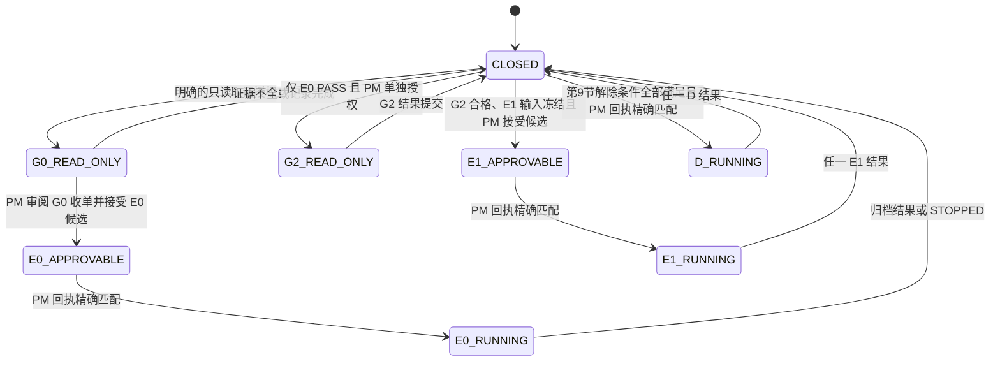

# 内存振闪退问题：第四轮发布执行计划与操作 AI 契约（round4-v4）

日期：2026-09-06  
文档角色：项目经理发布执行文档  
状态：**PUBLISHED / 当前 Gate 为 CLOSED**  
适用对象：负责实际 MCP/DMA 实验的操作 AI、主机证据收集者与项目经理 AI  
评审输入：[round4-v3 草案](memory-shock-crash-execution-plan-round4-v3-draft-20260906.md)、[第三轮记录](memory-shock-crash-update-round3-20260906.md)、[第三轮方案](memory-shock-crash-solution-round3-20260906.md)、`.tmp/crossfade_block9_fixed.json`

`round4-v2` 和 `round4-v3-draft` 均保留为历史评审材料，不能作为执行授权。本文件替代它们的执行语义；历史记录不改写。

## 1. 发布结论与当前状态

已核验的构建产物 `.tmp/crossfade_block9_fixed.json` 定义 `shellLength=360`、`blockLength=400`。因此本轮统一采用下列边界：

```text
B = block 起始地址，B[0..7] 为 control header
S = B + 8，为 vtable 指向的 shell 入口
shell = S..S+0x167 = B+0x08..B+0x16F，共 360B
T4 block = B..B+0x18F，共 400B
T4 tail = B+0x170..B+0x18F，共 32B，不属于 shell 指令区
历史 RCX 捕获尾部 = B+0x190..B+0x1A7，共 24B，已撤销且不属于 T4
```

任何将 T4 称为 424B、对 `B+0x190..B+0x1A7` 写入，或把 `B` 前的候选零区称为“可用/归属本实验”的说法，均与本计划不符。`B` 前的字节最多只能作为只读扫描范围记录，不能据此获得写入权。

当前接受的事实仅为：T0、T1、T2、T4 曾通过；`control=1` 是已观察到的退出触发条件；第三轮 RCX 捕获在放行后退出，但它同时引入了对 codecave 的 CPU 运行时写入。`.vmp1` 为 RX、AV、ACE、NULL 解引用和具体 faulting IP 都尚未得到本计划要求的证据，必须标为假设或未知。

```text
planVersion: round4-v4
currentGate: CLOSED
currentApproval: NONE
allowedWhileClosed: 已明确授权的只读取证、既有日志补全、主机证据归档
forbiddenWhileClosed: 任何目标进程写入、patch、vtable/control 改写、scratch 选址或试写、启动下一实验
```

本文件不是某一实验的批准记录。操作 AI 在 `currentGate=CLOSED` 时不得以“文档已发布”“前次做过 T4”或“有人口头同意”为依据执行写入。

## 2. 角色、单变量与停机边界

| 角色 | 职责 | 不得做的事 |
|---|---|---|
| 项目经理 AI | 冻结计划输入、签发单个实验批准回执、审阅证据、决定下一实验 | 执行 MCP/DMA 写入或临场修改实验参数 |
| 操作 AI | 只执行已批准的一个实验，采集证据、回滚、写账本和交接 | 自行改地址、字节、scratch、顺序、动作脚本或新增对照实验 |
| 主机证据收集者 | 在主机采集退出码、Event Log、dump 和时间线 | 将缺失日志解释成“没有异常”或替代 faulting IP |

每个新进程只允许执行一个实验 ID，且每个实验只有一个自变量。PID、`processStartUtc`、`generation`、游戏状态、模块 build、模块基址、候选 `B`、`temp`、vtable、`originalRet`、任一 `expectedBefore` 或预期页面属性发生变化，当前批准立即失效。操作 AI 必须停止目标写入，记录变化并重新走只读 preflight；不得在同一进程补测、重试或转入另一个实验。

一次 `CRASH`、`EXIT_UNKNOWN`、`STOPPED` 或 `INCONCLUSIVE` 后，操作 AI 只能继续取证和交接，不能开始下一个实验。项目经理必须在审阅该实验的完整证据后签发新的、不同 `approvalId` 的批准回执。

## 3. Gate 状态机



`E0 PASS` 只允许项目经理评审是否授权 G2，不能自动打开 G2、E1 或任何 D 实验。E0 非 `PASS` 时，Gate 保持 `CLOSED`；即使取得 faulting IP，它也只是下一份计划的评审材料，不能解锁任何写实验。后续写入只能由项目经理发布新的计划版本和新的批准回执。

## 4. 强制日志、证据与结果词汇

每个实验建立独立目录和账本：

```text
.tmp/memory-shock-round4/<experimentId>/<utc>/
docs/experiment-log/<experimentId>-<pid>-<utc>.md
```

目录至少包含：

```text
precondition-manifest.json    # 进程身份、模块 build、三次链快照、地址和保护证据
action-script.json            # 固定动作、次数、观察时长与中止条件
allowed-writes.json           # 全量、有序的目标写入及其回滚写入
rollback-plan.json            # 回滚顺序、每一步 readback 与失活/重启处置
runtime-effects.json          # 目标 CPU 运行时副作用；无副作用时为已哈希的空数组
outcome-rules.json            # 本实验结果判据、证据阈值与下一 Gate
timeline.jsonl                # 每一次读、写、readback、动作和退出事件
before-after.json             # T4、patch、vtable/control 的写前/写入/回读哈希
protection.txt                # PE section、VAD/PTE 或 UNKNOWN，含采集方法和时间
host-telemetry.txt            # 原始退出码、Event Log、dump/ProcDump 路径与采集失败原因
evidence-manifest.json        # 除自身外每个交付文件的 SHA-256 清单
approval-receipt.md           # 项目经理签发的批准回执原文
result.md                     # 观察事实、支持的假设、已验证结论和未决问题
```

`timeline.jsonl` 每条事件必须至少记录 UTC、实验 ID、PID、`processStartUtc`、`generation`、GA/EXE 基址、build 标识、游戏状态、事件类型、地址、长度、写前值、写入值、backend 返回值、readback、耗时和操作者。所有实际动作记录开始、结束和观察窗口。日志不得保存 MCP bearer token 或其他凭据。

每个实验同时记录两个互不混淆的字段：

```text
executionState: NOT_STARTED | STARTED | STOPPED | FINISHED
experimentOutcome: NOT_EVALUATED | PASS | CRASH | EXIT_UNKNOWN | INCONCLUSIVE
```

`STOPPED` 是执行状态，此时 `experimentOutcome=NOT_EVALUATED`；它不是实验结果。`FINISHED` 仅说明交付物已归档，不是实验结论。`CRASH` 仅表示已观察到目标异常退出；没有绑定的原始退出码、PID/`processStartUtc`、目标映像证据和时间窗口时，一律使用 `EXIT_UNKNOWN` 或 `INCONCLUSIVE`。次级主机证据只能证明“退出与实验时段相关”，不能证明 AV、写保护 fault、主动退出或具体指令位置，也不能满足任何要求 faulting IP 的 Gate。

进程仍存活时，固定回滚顺序为：`control=0` 并 readback -> 无输入空闲帧 -> vtable 恢复 `originalRet` 并 readback -> 恢复本实验 patch 和完整 T4 block 并 readback。进程已经退出时，账本必须写明 `rollbackDisposition: PROCESS_EXITED_RESTART_REQUIRED`；不得对已退出进程写入，也不得在新进程沿用旧地址或“补回滚”。

## 5. F1：冻结计划、独立批准回执与证据收单

本节替换 v3 的 F1。原则是先冻结完整计划，再由项目经理签发回执；`approvalId` 不属于计划记录，因此不存在 hash 自引用，也不存在批准后由操作 AI 补全写入清单的空间。

### 5.1 计划候选与哈希边界

操作 AI 只在得到只读 preflight 结果后创建候选账本。候选账本尚未获准，创建它不允许写目标进程。计划段由以下精确字节组成：

```text
PLAN_RECORD_BEGIN<LF>
<下述固定顺序的单行字段，全部使用 ASCII 值><LF>
PLAN_RECORD_END<LF>
```

编码必须是 UTF-8 without BOM；行尾必须是 LF；最后一行也必须有 LF；字段名只能出现一次；不得插入空行、注释、多行值或重复字段。固定字段顺序如下：

```text
schemaVersion
publishedPlanPath
publishedPlanSha256
planVersion
experimentId
operatorId
createdUtc
pid
processStartUtc
generation
targetImagePath
targetImageSha256
moduleBuildId
gaBase
exeBase
preconditionEvidenceManifestSha256
actionScriptSha256
allowedWritesSha256
allowedWritesCount
rollbackPlanSha256
runtimeEffectsSha256
outcomeRulesSha256
nextGateOnPass
nextGateOnNonPass
PLAN_RECORD_END
```

`planRecordSha256` 覆盖从 `PLAN_RECORD_BEGIN` 行首到 `PLAN_RECORD_END` 行终止 LF 的全部字节，其中包含所有行终止的 `0x0A`。作为紧随其后的唯一 trailer：

```text
planRecordSha256: <64 位小写十六进制>
```

该 trailer 不在哈希范围内。计划段和 trailer 写入后绝不修改。任何字段、证据、地址、值、脚本、目标进程或 build 的变化都必须新建账本候选和 hash；`amendment` 只能产生新文件和新批准，不能覆盖旧文件。

### 5.2 外部冻结输入

下面六个文件是计划内容的一部分，必须在批准前生成，并采用 UTF-8 without BOM、LF、稳定字段顺序和稳定数组顺序。每个文件的 hash 写入计划段：

| 文件 | 必须包含的内容 |
|---|---|
| `precondition-manifest.json` | PID、`processStartUtc`、`generation`、目标映像路径/hash、GA/EXE 基址、module build、游戏状态、三次链快照、B/S/temp/vtable/`originalRet`/CrossFade、页保护与采集时间 |
| `action-script.json` | 动作名称、输入、次数、每次开始/结束规则、每次后的观察秒数、总时限和停止条件 |
| `allowed-writes.json` | 按执行顺序列出每一项 DMA 目标写入与每一项存活时的回滚写入：`ordinal`、`label`、`address`、`length`、`expectedBeforeHex`、`dataHex`、`readbackRule`、`purpose` |
| `rollback-plan.json` | `control=0`、空闲帧、vtable 恢复、patch/block 恢复的顺序；每项 expected-before/readback；进程退出时的 `RESTART_REQUIRED` 处置 |
| `runtime-effects.json` | 每个目标 CPU 运行时副作用的 `effectId`、触发点、地址/范围、写前值或原始状态、允许动作次数、动作后 readback、恢复条件和 `PROCESS_EXITED_RESTART_REQUIRED` 处置；无副作用时必须是 `[]` |
| `outcome-rules.json` | 该实验的 `PASS`、`CRASH`、`EXIT_UNKNOWN`、`INCONCLUSIVE`、`NOT_EVALUATED` 判据，证据阈值、不得推出的结论和停止条件 |

`allowed-writes.json` 必须包含完整的、可执行的写入值，而不是“写 block”“写 control”之类的摘要。每一候选只包含该实验真正需要的 DMA 写入与回滚，不得携带其他实验变量。E0 候选必须逐项包含初始 T4 block、vtable、E0 patch、`control=1`、`control=0`、vtable 恢复、patch 恢复和 block 恢复；E1 或 D 候选必须按其独立计划列出自己的完整集合。操作 AI 不得依照回执文本之外的推断补充写入。

`runtime-effects.json` 与 `allowed-writes.json` 同等受控。特别是 E1 的 CPU `SCRATCH` 写入必须在其中冻结其准确地址、允许范围、触发动作、写前值、动作后 readback 与恢复或重启处置；没有此文件的 E1 候选不能批准。D3、D4、D5 同样必须列出各自的运行时状态副作用，不能把静态 DMA patch 的回滚当成运行时状态回滚。

### 5.3 批准回执与执行前核验

项目经理在审阅候选后才可创建 `approval-receipt.md`。回执使用与计划段相同的 UTF-8 without BOM、LF、单行、无空行/注释/重复字段规则；从 `APPROVAL_RECEIPT_BEGIN` 行首到 `APPROVAL_RECEIPT_END` 行终止 LF 的全部字节是其唯一 hash 范围。字段顺序固定如下：

```text
APPROVAL_RECEIPT_BEGIN
approvalId
decision: APPROVED
publishedPlanPath
publishedPlanSha256
planVersion
experimentId
planRecordSha256
preconditionEvidenceManifestSha256
actionScriptSha256
allowedWritesSha256
rollbackPlanSha256
runtimeEffectsSha256
outcomeRulesSha256
pid
processStartUtc
generation
targetImageSha256
moduleBuildId
gaBase
exeBase
issuedUtc
expiresUtc
APPROVAL_RECEIPT_END
```

`approvalReceiptSha256` 是回执 hash 范围的 SHA-256，作为 `approvalReceiptSha256: <64 位小写十六进制>` 的边界外唯一 trailer 写入；trailer 不在自身 hash 范围内。操作 AI 执行前必须独立复算计划、六个冻结输入和回执 hash，并逐项比较计划、回执与实时只读 preflight。`publishedPlanPath` 必须是本文件，`publishedPlanSha256` 必须等于其实际文件 hash；候选中的 `nextGateOnPass` 与 `nextGateOnNonPass` 必须均为 `CLOSED`。任何不等、缺文件、过期、PID 重用、`expectedBefore` 不匹配或额外写入需求都必须产生 `STOPPED`，不得写入。批准只对这一份进程实例、一个实验 ID 和这个全量写入数组有效。

最终归档顺序固定为：先完成并冻结六个计划输入、`timeline.jsonl`、`before-after.json`、`protection.txt`、`host-telemetry.txt`、`approval-receipt.md`、`result.md` 与账本的计划/批准部分；接着生成 `evidence-manifest.json`，它必须逐项列出上述冻结路径及 hash，并以 `ledgerPlanRecordSha256` 代表账本的冻结前缀。manifest 不列自身，也不列尚未追加的结果段。计算 `evidenceManifestSha256` 后，禁止修改其覆盖的任何文件；最后只允许在账本追加结果段：

```text
RESULT_RECORD_BEGIN
planRecordSha256: <...>
approvalReceiptSha256: <...>
evidenceManifestSha256: <...>
executionState: <...>
experimentOutcome: <...>
rollbackDisposition: <...>
RESULT_RECORD_END
resultRecordSha256: <...>
```

`resultRecordSha256` 覆盖从 `RESULT_RECORD_BEGIN` 行首到 `RESULT_RECORD_END` 行终止 LF 的全部字节，并包含每个 `0x0A`；结果 trailer 不在自身 hash 范围内。项目经理只在 `planRecordSha256`、`approvalReceiptSha256`、`evidenceManifestSha256` 和 `resultRecordSha256` 全部可复算且相互匹配后收单，并返回收单回执。结果、证据包、日志或 hash 不一致时，实验为 `INCONCLUSIVE`，Gate 保持关闭。

## 6. G0：只读 preflight

G0 只收集证据，不产生 `allowedWrites`，不改目标进程。G0 开始前先在 G0 目录冻结 `action-script.json`，其内容必须明确正常动作、输入、三次次数和每次 30 秒观察窗口，并记录 `g0ActionScriptSha256`。后续 E0 候选的 `actionScript.json` 必须逐字节复用该文件；动作、次数、输入、观察窗口或游戏状态变化时，G0 必须从头重做。每一候选进程应完成：

1. 记录启动时间、PID、`processStartUtc`、退出监控方式和主机时间源。
2. 采集目标映像路径、hash、GA/EXE 基址、module build 标识和游戏状态。
3. 三次采样 `B`、`S`、`temp`、vtable、`originalRet`、CrossFade 及其必要链值，间隔 50ms；值不一致即停止。
4. 仅读取并保存 `B..B+0x18F` 的 400B 基线 hash、vtable 原值，确认该区间不跨页；历史尾部 `B+0x190..B+0x1A7` 只能记录为未使用范围。
5. 读取 `.vmp1` 所属 PE section 的 R/W/X 位；尽力获取同一目标 VA 的 VAD/PTE 证据。PE section 的 W 位不能替代运行时页保护。VAD/PTE 无法取得时必须写 `UNKNOWN`，不得据此推断 CPU 可写。
6. 主机侧记录 LocalDumps 的实际键值和目录、退出码采集方式、Application 1000/1001/1026 与 System 7031/7034 的原始查询范围。`7031/7034` 没有目标 PID/映像绑定时不能单独采信。
7. 在没有实验写入的正常状态下，执行固定动作脚本 3 次，每次后观察 30 秒，记录进程状态和新增关键事件。

G0 记录不全、地址不稳定、section 与已取得 VAD/PTE 结论冲突或主机时间无法对齐时，结果为 `INCONCLUSIVE`。VAD/PTE 为 `UNKNOWN` 不会证明或否定 E0，但会阻断任何依赖 CPU 可写 scratch 的 E1。

## 7. E0：无 CPU 运行时写入的对照实验

E0 是目前唯一可以在 G0 完整后申请批准的写实验。它仍包含 DMA 写入；“无运行时写入”仅指 shell 在游戏 CPU 执行期间不写入 codecave 或 scratch。

候选补丁仅为已核算的 8B：

```text
位置：shell[92..99] = B+0x64..B+0x6B
expectedBefore：4C 8B 59 10 4D 8B 5B 18
data：E9 AA 00 00 00 90 90 90
语义：从 shell[92] 跳到 shell[267]；E9 下一条为 shell[97]，位移 267-97=0xAA
```

`E9 AB 00 00 00` 加四个 NOP 共 9B，会越过该 8B 替换范围，禁止列入任何写入清单。

E0 的批准候选必须把下列实际操作完整编码进 `allowed-writes.json` 和 `action-script.json`，而不是把它们作为口头步骤：写入并回读 400B T4 block；vtable 写 `S` 并回读；`control=0` 时验证一次 T4 基线；写入并回读 8B E0 patch；写 `control=1` 并回读；执行 3 次固定动作且每次观察 30 秒；随后按第 4 节回滚。每个写入在批准前已有精确地址、长度、写前值、数据、readback rule 和回滚字节。

| E0 结果 | 可写入的结论 | 后续状态 |
|---|---|---|
| `PASS` | 放行后直接进入公共恢复区在该受控条件下稳定；这支持“第三轮新增 CPU 写入是变量”的假设 | 回滚、归档并关闭 Gate；项目经理可单独评审 G2 |
| `CRASH` | 该对照仍退出；不能归因 codecave 写保护 | 关闭 Gate；faulting IP 仅用于下一份计划评审 |
| `EXIT_UNKNOWN` / `INCONCLUSIVE` | 退出或证据分类失败 | 关闭 Gate；只允许补充主机证据 |
| `executionState=STOPPED`，`experimentOutcome=NOT_EVALUATED` | preflight、hash、写前值或回读不符合 | 关闭 Gate；不得替换参数后重试 |

## 8. G2 与 E1：scratch 资格和 RCX 捕获

G2 是一个受项目经理单独指定的只读资格审查。操作 AI 不得扫描或试写 GA `.data` slack、其他模块 slack、heap 空洞、codecave 或未知页来“寻找” scratch。候选地址必须由目标模块/测试环境所有者提供，并在当前新进程满足以下全部条件：

1. 有书面的诊断专用所有权和生命周期说明，不被游戏对象、vtable、metadata、容器、堆管理或数组使用。
2. 对应 VAD/PTE 明确为 RW 或 RWX，且与映像映射信息不矛盾。
3. 最少 8B、8B 对齐、不跨页；完整回滚范围已定义。
4. 连续 3 次、间隔 50ms 的完整只读快照一致。
5. 已记录写前原值、未来回滚值、expected-before 与 readback 规则。
6. 已说明相邻区域及写入不会改变游戏状态的理由。

任一项缺失时，G2=`BLOCKED`，E1 仍不可申请。G2 不授权任何试写。

通过 G2 后，E1 仍需一份新的 E1 补充计划和批准回执。补充计划必须冻结 `SCRATCH VA`、所有权证据、VAD/PTE 证据、汇编器生成的完整 patch bytes、每条指令 offset/branch displacement、寄存器/flags 保存恢复说明、每一 DMA 写入和回滚字节。`B+0x1A0` 的历史捕获模板已永久撤销，不能作为默认、备选或临场回退。

E1 捕获值不能只因非零而称为“合法 RCX”。在计划下一项 D 实验前，必须用当前进程的只读证据确认：RCX 非零；`RCX+0x10` 所在 8B 可读；第一层值非零且其 `+0x18` 所在 8B 可读；三项地址均在当前进程映射范围；并记录 RCX 与 `temp`、vtable、B/S 的关系。任何一项失败都只产生 `INCONCLUSIVE` 或“旧链假设不成立”，不能自动进入 D1a。E1 结束后同样关闭 Gate，项目经理另行批准下一个实验。

## 9. Active path 候选与阻塞项

以下表格是项目经理未来可评审的候选，不是已批准任务。每一项都必须用新进程、完整 T4 基线、独立计划候选和独立 approvalId。不得按列表连续推进。

| 实验 | 当前状态 | 已知语义或约束 | 解除条件 |
|---|---|---|---|
| D1a | NOT_ELIGIBLE | `B+0x68` 的跳转在第一次 `[RCX+0x10]` 后进入恢复区；只可在 E1 已验证入口链后评审 | E1 完整收单，新的单实验计划 |
| D1 | NOT_ELIGIBLE | 只用于比较第二次 `[r11+0x18]` 解引用前后的结果 | D1a 收单，新的单实验计划 |
| D2 | BLOCKED | `EB 7F` 自 `B+0x92` 跳至 `B+0x113`，会跳过 `B+0x94..B+0x112` 后进入恢复区；它不是“执行中段后恢复” | 当前 build 的重新反汇编、原始字节、目标和恢复区一致性证据全部冻结后，新的计划 |
| D3 | BLOCKED | 保留 `breakData` 的目标 CPU 写入，静态 patch 回滚不能恢复运行时游戏状态 | 逐项定义 `breakData` 所有权、生命周期、写前快照、运行时 readback、恢复条件；无法恢复时须在批准中明确本进程作废并重启 |
| D4 | BLOCKED | 去除 `breakData` 写入但仍可能进入有游戏状态副作用的调用路径 | 明确被调路径副作用、观察窗口、恢复/重启处置和新的单实验批准 |
| D5 | BLOCKED | 禁用 `call` 但仍保留 `breakData` 运行时写入和参数准备 | 与 D3 相同的运行时状态恢复证据，另加 `FF D0` 原始字节和 patch 范围复核 |

D2 解除阻塞后也只能解释为一个跳过中段的对照：在已知 E0 稳定、D1 稳定且 D2 `PASS` 的条件下，它支持故障位于被跳过区间的假设；D2 `CRASH` 说明故障没有被该跳过移除，或 patch/恢复路径存在问题，不能定位 CharacterManager/local-player 链。D3、D4、D5 的任何结果都不能在缺少规定的运行时状态证据时推进到源码修复。

## 10. 全局停止条件、交接和修复闸门

以下任一情况立即停止本进程的所有目标写入：hash 或回执不匹配；写前值/readback 不匹配；地址、跳转位移或长度无法由冻结文件核算；跨页或地址所在映射身份不明；E1 或任一 D 实验所依赖的 CPU 页保护未知；链不稳定；动作时间无法对齐；日志相互矛盾；目标退出原因不能分类；需要新 scratch、fallback RVA、shell 模板、NOP 或额外写入。G0 中记录为 `VAD/PTE=UNKNOWN` 的 B 页只允许进入明确写有“无 CPU 运行时写入”的 E0 候选，不能作为 E1/D 实验的 CPU 写目标依据。若目标存活，先执行已批准的回滚清单；若目标退出，记录 `PROCESS_EXITED_RESTART_REQUIRED`。

`STOP` 交接记录必须包含实验 ID、批准和计划 hash、最后成功步骤、最后一次读写、当前进程状态、已归档文件、观察事实、未知项和唯一等待项目经理决定的问题。结论必须分为“观察事实”“支持的假设”“已验证结论”。单次实验不得写“根因已确认”“实锤”“必然”或等价表述。

操作 AI 发现文档矛盾、字段缺失、地址无法核算或上一条指令与当前计划冲突时，必须提交问题单而不是修改账本或计划。问题单格式固定为：

```text
ISSUE_BEGIN
issueId: <唯一编号>
experimentId: <当前实验或 NONE>
severity: BLOCKING | HIGH | LOW
observedAtUtc: <时间>
sourceRefs: <文档/日志/证据路径及行号>
observedFact: <可复核事实>
unknownOrConflict: <未知项或冲突>
lastSafeStep: <最后安全步骤>
requestedDecision: <只允许项目经理回答的问题>
ISSUE_END
```

问题单提交后，当前 Gate 保持关闭；项目经理只能通过新版本计划、修订账本和新的批准回执处理它。操作 AI 不得以“修正文档排版”“临时补齐字段”或“重复一次确认”为理由继续写入。

只有在以下条件全部满足后，项目经理才可创建独立的源码修复任务：E1 的入口链已按第 8 节验证；某一故障边界在两个新进程中以同一冻结计划重复；主机证据能够区分 AV、主动退出、写保护 fault 或未知退出；所有运行时副作用已有恢复或重启处置；且新的模板长度、branch displacement、metadata 偏移与完整 block hash 已重新核算。否则最终状态只能是 `ROLLBACK_TO_READ_ONLY` 或 `INCONCLUSIVE`。

## 11. 操作 AI 执行清单

开始前：确认当前 Gate、实验 ID 和 approvalId；复算所有计划/输入/回执 hash；比对实时 PID、进程启动时间、build、基址、generation 和三次快照；确认主机监控正在运行；确认完整 `allowed-writes.json` 同时含回滚写入。

执行中：只按数组 ordinal 执行；每次写前比较 `expectedBefore`，每次写后记录 backend 结果和 readback；不自动重试；不改变动作、观察时间、地址或字节；一旦停止条件触发，立即停止。

结束后：目标存活时按批准的顺序回滚并回读；完成 host telemetry；生成 evidence manifest、结果段和全部 hash；交付账本；等待项目经理收单和下一条明确批准。没有新的回执时，任何后续动作都是禁止的。

## 12. 当前唯一执行指示：R4-G0-READ-ONLY

本节是当前唯一有效的操作指示，适用于一份全新的测试进程。它只授权 G0 的只读采集和本地日志写入；**不授权任何目标进程写入**。

```text
directiveId: R4-G0-READ-ONLY-20260906
gateBefore: CLOSED
allowedTargetOperations: 只读取证
forbiddenTargetOperations: DMA 写入、T4 写入、vtable/control 改写、E0 patch、scratch 选址或试写
requiredDelivery: G0 证据目录 + G0 账本 + 只读收单请求
gateAfter: CLOSED
```

操作 AI 必须按以下顺序执行：

1. 启动新的测试进程，建立 `.tmp/memory-shock-round4/G0/<utc>/` 与 `docs/experiment-log/G0-READ-ONLY-<pid>-<utc>.md`；记录本文件的实际 SHA-256、PID、`processStartUtc` 和 `generation`。
2. 在目录中创建并冻结 G0 `action-script.json`。脚本只能包含正常游戏动作、三次重复和每次 30 秒观察；计算 `g0ActionScriptSha256`。脚本冻结后不得改变。
3. 完成第 6 节第 1-6 项的三次地址/链采样、400B T4 基线只读 hash、PE/VAD/PTE 证据和主机取证配置检查。整个过程不得写 B、S、vtable、control、patch 或任何 scratch。
4. 严格使用已冻结脚本执行第 6 节第 7 项，记录每次动作的开始/结束 UTC、观察窗口、进程状态、退出码和新增事件。
5. 写 `result.md` 与 G0 账本，仅列观察事实、未知项和 `PASS` 或 `INCONCLUSIVE` 的 G0 资格判定；不得声明任何 crash 根因。
6. 交付 G0 证据目录和账本，请求项目经理收单。此时不得生成任何 E0 写入、不得将 `control` 设为 1、不得继续 E1/D 实验。

只有 G0 被收单为 `PASS` 后，操作 AI 才可**不写目标进程**地准备 E0 候选：复制同一份 `action-script.json`，生成第 5 节规定的六个冻结输入、完整 `allowed-writes.json`、计划记录和 `planRecordSha256`，然后提交项目经理。收到精确匹配的 E0 `approval-receipt.md` 前，E0 仍然禁止执行。G0 为 `INCONCLUSIVE` 或出现任何停止条件时，提交问题单并保持 Gate 为 `CLOSED`。
